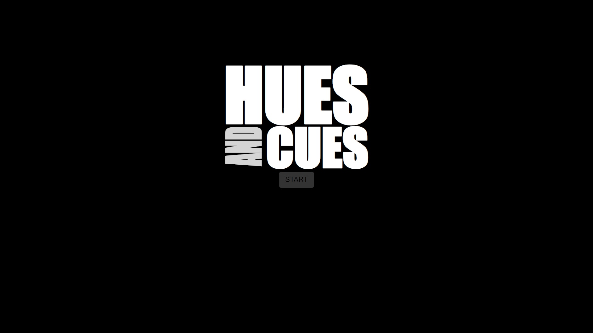
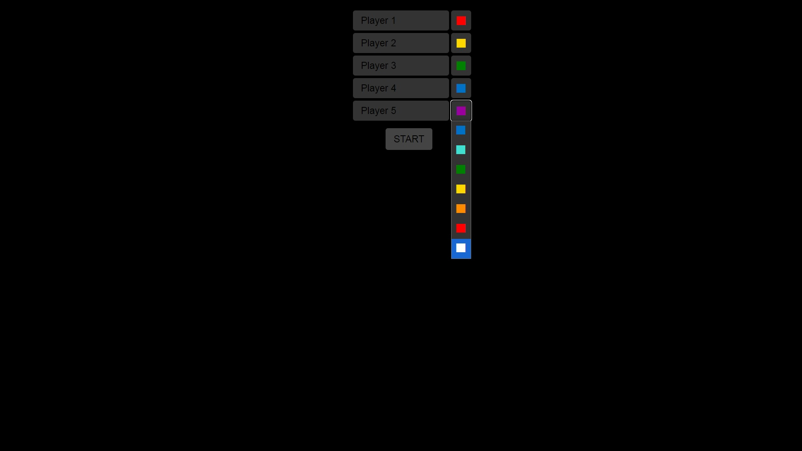
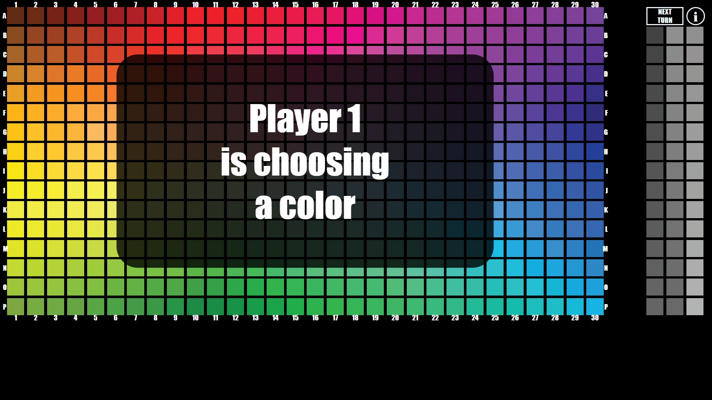
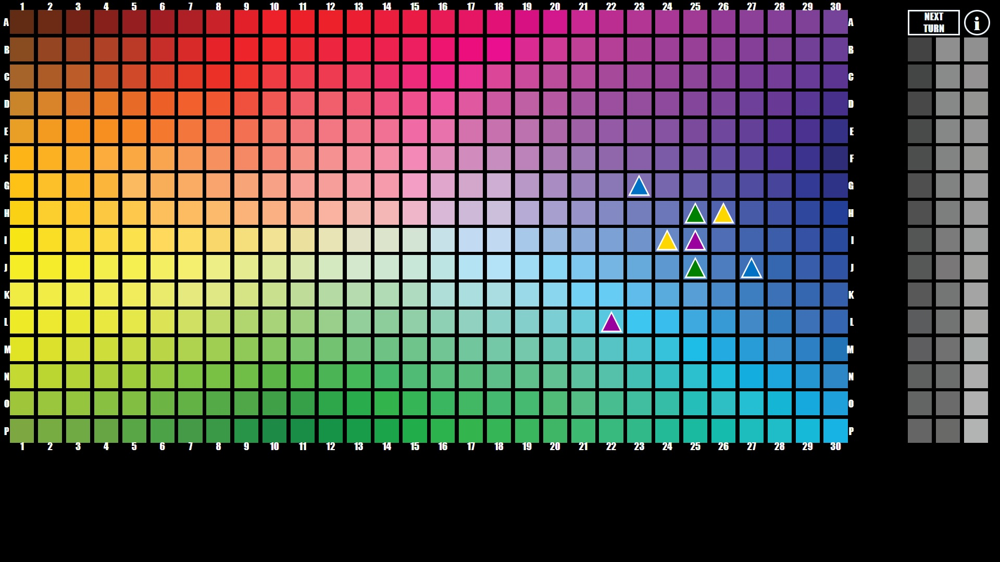
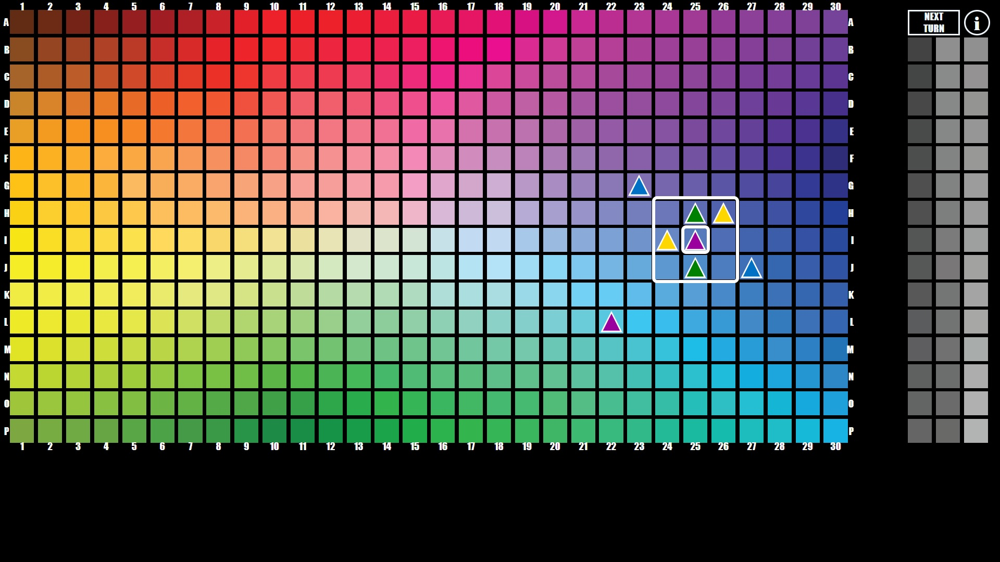
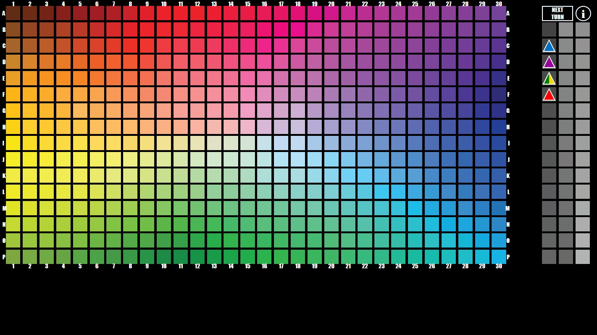
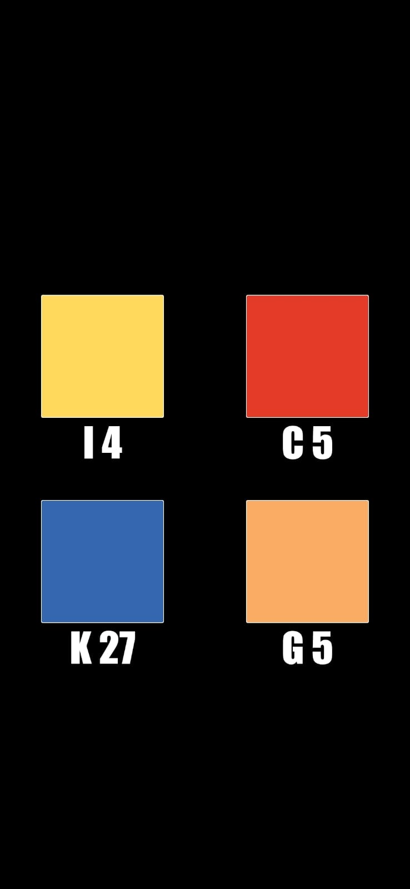
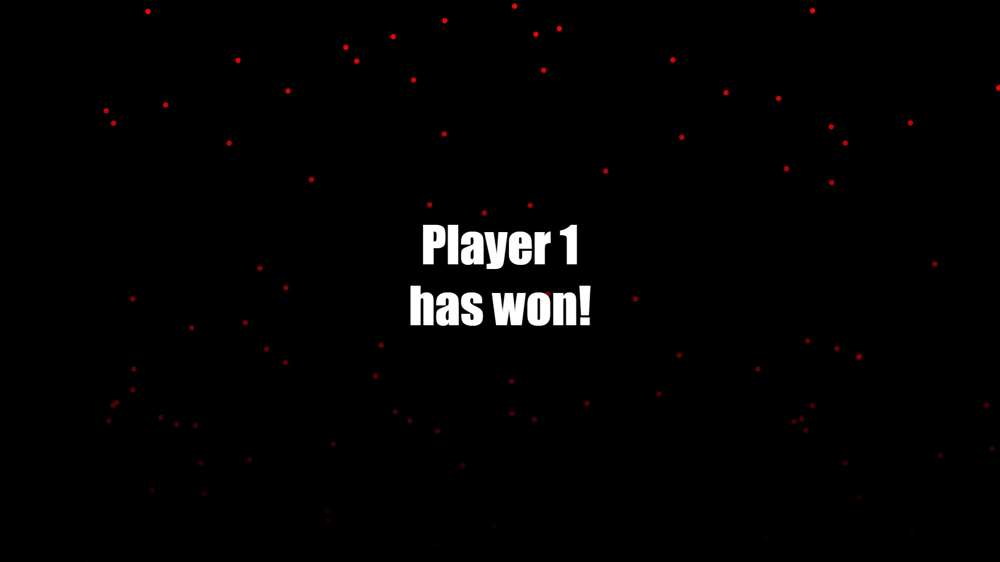

```
  _   _                    _              _  ____                
 | | | |_   _  ___  ___   / \   _ __   __| |/ ___|   _  ___  ___ 
 | |_| | | | |/ _ \/ __| / _ \ | '_ \ / _` | |  | | | |/ _ \/ __|
 |  _  | |_| |  __/\__ \/ ___ \| | | | (_| | |__| |_| |  __/\__ \
 |_| |_|\__,_|\___||___/_/   \_\_| |_|\__,_|\____\__,_|\___||___/
                                                                 
```
## Description
This is a web-based implementation of the board game Hues and Cues, built using HTML, CSS, and JavaScript. The game is designed to be played by 2-6 players. The game is played in real-time, and the game state and score are updated automatically for all players. The game is designed to be played on a computer, but it can be played on a mobile device as well. However the inteded experience is the following:
- While the game is being run on a computer the main menu and the game board are displayed for all the players to see.
- Each player has a mobile device and by running the same website on their device they will draw a random color card in order to select their color for the game.

## About the board game
Hues and Cues is a vibrant game of colorful communication where players are challenged to make connections to colors with words. Using only one and two-word cues, players try to get others to guess a specific hue from the 480 colors on the game board. The closer the guesses are to the target, the more points you earn. Since everyone imagines colors differently, connecting colors and clues has never been this much fun!

## How to play
1. Open the game on a computer and select the number of players, player names, and their colors.
2. The game is played in rounds, and each player takes a turn to be the active player.
3. The active player draws a card from the color deck' by opening the game on their mobile device and selects a color from the card. The active player then gives a one word clue to the other players to help them guess the color. (You can also swipe to the side to draw another card if you don't like the color on the first card.)
4. The other players place their pieces on the game board to indicate their guesses.
5. After all the guesses are placed, the active player gives a two word clue to the other players to help them better guess the color.
6. The other players once again place their pieces on the game board to indicate their guesses.
7. After all the guesses are placed, the active player reveals the correct color on the card.
8. At the end of the round, points are awarded automatically:
- 3 points for the player who guessed the correct color
- 2 points for the player who guessed within 1 space of the correct color
- 1 point for the player who guessed 2 spaces of the correct color
- the active player also gains 1 point for each correct guess
within the scoring square
9. The game continues until one player scores a total of 45 points.

## Screenshots

### Hues and Cues homepage:



### Player selection page:



### Gameplay screenshots:









### When viewed on a mobile device:



### Winning screen:


